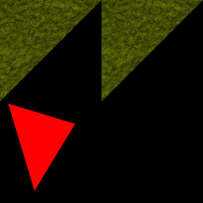
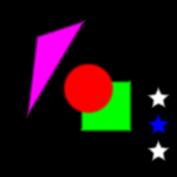
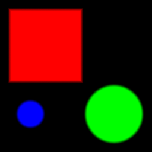
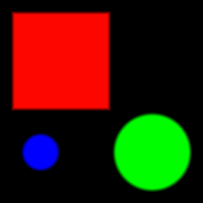
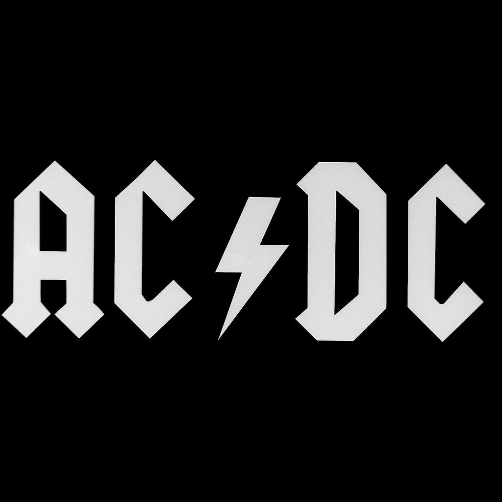
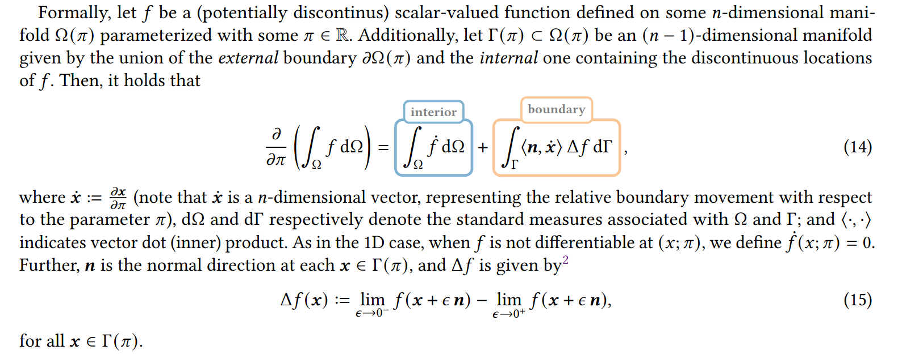
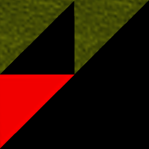
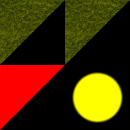

# Задание 2. Дифференцируемый рендер в 2D

В этом задании вам предстоит реализовать дифференцируемый рендер треугольников и SDF на плоскости и использовать его для восстановление параметров сцены по изображению. И базовая, и дополнительная части задания разбиты на несколько частей, по которым вы можете получить баллы независимо друг от друга. Рекомендую прочитать задание целиком перед началом выполнения первого пункта.
При восстановлении параметров сцены предлагается использовать алгоритм оптимизации Adam и функцию потерь MSE. При условии, что мы работаем с трехканальными изображениями и цвет каждого
пикселя находится в диапазоне [0, 1], во всех пунктах **при оптимизации нужно достичь MSE < 0.005**.

В задании используется класс сцены со следующим описанием
```c++
struct Image
{
    //...
};
struct SDF
{
    //...
};
struct Circle : public SDF
{
    Circle(vec2 _center, float radius, const vec3 &_color);
};
struct Box : public SDF
{
    Box(vec2 _center, vec2 _size, const vec3 &_color);
};
struct Triangle : public SDF
{
    Triangle(vec2 _p0, vec2 _p1, vec2 _p2, const vec3 &_color);
};
struct ImageSDF : public SDF
{
    ImageSDF(vec2 _center, vec2 _size, const vec3 &_color, Image &_image);
};
struct TriangleMesh 
{
    std::vector<vec2> vertices;
    std::vector<ivec3> indices;
    std::vector<vec3> colors; // defined for each face
    std::vector<vec2> tc;
    std::vector<Image *> textures;
};
struct Scene
{
    TriangleMesh triangle_mesh;
    std::vector<SDF *> SDFs;
};
```

## Часть 1. Не-дифференцируемый рендер сцены (3 балла)

Посмотрим на предлагаемую структуру сцены. Она состоит из треугольного меша и списка SDF разных типов. Вам требуется реализовать их отрисовку в массив и последующее его сохранение как изображение на диск. Используйте для этого код 1 задания для SDF и напишите аналогичный для треугольников. Для более простой реализации дифференцируемого рендера необходимо:

1) Цвет каждого пикселя определять как среднее цветов в N случайно взятых точках в пределах этого пикселя (семплах).

2) Альфа-смешивание цветов разных объектов в семпле в фиксированном порядке.
(например, в порядке добавления SDF в массив)

3) Для меша $ a_{i} = 1 $, если пиксель принадлежит мешу, $ a_i = 0 $ иначе. Для SDF $ a_i = smoothstep(0, th, dist) $

4) Для семплирования из текстуры использовать билинейную фильтрацию,
   как для текстур треугольников, так и для текстур с SDF

Цвет SDF одинаковый в любой его точке, треугольники могут быть как одноцветными, так и текстурированными, но без прозрачности. 

Ниже показаны примеры сцен и полученных изображений
```c++
    Image tex1("grassTexture.png");
    TriangleMesh mesh{
        // vertices
        {{0.0, 0.0}, {0.5, 0.0}, {0.0, 0.5},
         {0.5, 0.0}, {1.0, 0.0}, {0.5, 0.5},
         {0.04, 0.51}, {0.37, 0.61}, {0.17, 0.94}},
        // indices
        {{0, 1, 2},
         {3, 4, 5},
         {6, 7, 8}},
        // color
        {{1, 0, 0},
         {1, 0, 0},
         {1, 0, 0}},
        // tc
        {{0, 0}, {1, 0}, {0, 1},
         {0, 0}, {1, 0}, {0, 1},
         {0, 0}, {1, 0}, {0, 1}},
        // textures
        {&tex1, &tex1, nullptr}};
    Scene scene{mesh, {}};
```



```c++
    TriangleMesh mesh{};

    Image test_sdf("01-sdf.png", -1, 1);
    std::vector<SDF *> SDF_scene;
    SDF_scene.push_back(new Circle(vec2(0.5, 0.5), 0.15, {1, 0, 0}));
    SDF_scene.push_back(new Box(vec2(0.6, 0.6), vec2(0.15, 0.15), {0, 1, 0}));
    SDF_scene.push_back(new Triangle(vec2(0.2,0.2), vec2(0.5, 0.1), vec2(0.14, 0.7), {1, 0, 1}));
    SDF_scene.push_back(new ImageSDF(vec2(0.8, 0.45), vec2(0.2, 0.2), {1,1,1}, test_sdf));
    SDF_scene.push_back(new ImageSDF(vec2(0.8, 0.6), vec2(0.2, 0.2), {0,0,1}, test_sdf));
    SDF_scene.push_back(new ImageSDF(vec2(0.8, 0.75), vec2(0.2, 0.2), {1,1,1}, test_sdf));
    
    Scene scene{mesh, SDF_scene};
```




## Часть 2. Differentiable SDF rendering (6 баллов)

Дифференцируемый рендер в широком смысле подразумевает создания такого алгоритма (функции) рендера $ F : F(Scene) = Image $, что мы может также вычислить $ dF/dScene $, однако на практике подобная матрица Якоби будет иметь слишком большой размер из-за, в первую очередь, большой размерности вектора $Image $. 
Самым частым случаем использования дифференцируемого рендера является поиск оптимальных параметров сцены с помощью градиентного спуска, т.е. решение задачи минимизации:
 $$  \min_{S \in \mathbb{S}}(Loss(F(S), Reference)) $$  
для чего требуется находить уже $ dLoss/dS $ - вектор градиента размера такого, сколько параметров в сцене.

Мы будем использовать MSE в качестве функции потерь.

 $$  MSE(I, Reference) = \sum_{i=1, j = 1}^n(I_{ij} - Reference_{ij})^2 $$  

 $$  \frac {dMSE}{dS} = \sum_{i=1, j = 1}^n[(I_{ij} - Reference_{ij})* \frac{dI_{ij}}{dS}] $$  
Таким образом нам достаточно считать $ dI_{ij}/dS $ - градиент цвета пикселя по параметрам сцены. Для того, чтобы это сделать, нужно вспомнить, как формально определяется цвет пикселя:

 $$   I_{ij} = \int_{p \in P} f(p,S)dP $$  

Функция $ f $ здесь задает цвет в каждой конкретной точке нашего изображения.
Правила рисования SDF из предыдущего пункта гарантируют нам непрерывность функции f по всем параметрам сцены. Блягодаря этому, мы можем занести дифференцирование под интеграл. Работе с разрывными функциями посвящены следующие разделы:

 $$   \frac{dI_{ij}}{dS} = \int_{p \in P} \frac{df(p,S)}{dS}dP  $$   

В этом пункте наша сцена состоит только из SDF, и параметры сцены представляются следующим образом: $ S = (S_1, ..., S_k) $

$ S_i $ - параметры одной фигуры. Для круга $ S_i = (x_i, y_i, r_i, R_i, G_i, B_i) $ - позиция, радиус и цвет.

 $$   f(p,S) = \sum_{i=1}^kw_i * [R_i, G_i, B_i] $$  
 $$   w_i = (1 - w_{i-1})*smoothstep(0, th, -SD(p, S_i)) $$  
$SD(p, S_i)$ - расстояние со знаком от точки p по i-го SDF.
Например, для круга:
 $$  SD(p, S_i) = \sqrt{(p.x - x_i)^2 + (p.y - y_i)^2} - r_i $$  

Мы можем легко посчитать производные SD по параметрам SDF:
 $$  \frac d{dr}SD(p, x, y, r) = -1; $$  
 $$  \frac d{dx_0}SD(p, x, y, r) = \frac{-(p.x - x_0)}{\sqrt{(p.x - x_0)^2 + (p.y - y_0)^2}} $$  
 $$  \frac d{dy_0}SD(p, x, y, r) = \frac{-(p.y - y_0)}{\sqrt{(p.x - x_0)^2 + (p.y - y_0)^2}} $$  

Используя правила вычисления производных, мы можем посчитать $ \frac{df}{dS} $. Для вычисления $ \frac{dI_{ij}}{dS} $ нужно использовать приблизительное вычисление интеграла методом Монте-Карло. В данном случае это означает усреднение значений $ \frac{df}{dS} $ в нескольких случайно взятых точках внутри пикселя (семплах). Количество семплов вы можете выбрать сами, но рекомендуется брать небольшое число (<10).

В этой части вам необходимо будет реализовать дифференцируемый рендер простых SDF (как минимум круг и прямоугольник), а также SDF-изображений.
Каждый SDF имеет параметр цвета и несколько параметров, отвечающих за его форму. Для SDF-изображения таким параметров является само одноканальное изображение, т.е. для изображения 32x32 вы будете иметь 1027 параметров (1024 пикселя с дистанцией и 3 канала цвета). 
Для получение дистанции от точке до такого SDF необходимо делать выборку из SDF-изображения с билинейной фильтрацией. Обратите на это внимание, использование цвета ближайшего пикселя уменьшет качество и, скорее всего, не даст вам получить достаточно низкий MSE при оптимизации. 
Также необходимо реализовать метод оптимизации $ Adam $ и использовать его, чтобы восстановить параметры SDF на сцене.

После реализации восстановите исходную сцену:



По следующему начальному приближению:

```c++
        TriangleMesh mesh{};
        
        std::vector<SDF *> SDF_scene;
        SDF_scene.push_back(new Box(vec2(0.31, 0.28), vec2(0.25, 0.25), {0.7, 0.7, 0}));
        SDF_scene.push_back(new Circle(vec2(0.7, 0.7), 0.1, {0.543, 0.2232, 0.42}));
        SDF_scene.push_back(new Circle(vec2(0.23, 0.72), 0.12, {0.1,0.6,1}));
        
        Scene scene{mesh, SDF_scene};
```

Должен получиться результат, почти не отличимый от исходной картинки:



Также дифференцируемый рендер SDF-изображений позволяет автоматически конвертировать монохромные изображения в SDF. Оптимизация подбирает такое SDF-изображение, чтобы минимизировать функцию потерь между ним и исходным. 
Проверьте результат на примере с логотипом:



Начальное приближение
```c++
        Image opt_sdf(64, 64);//put small random values here
        
        TriangleMesh mesh{};
        std::vector<SDF *> SDF_scene;
        SDF_scene.push_back(new ImageSDF(vec2(0.0, 0.0), vec2(1, 1), {1, 1, 1}, opt_sdf));

        Scene scene{mesh, SDF_scene};
```

Результат (Изображение)


Результат (SDF)


## Часть 3. Производные по цвету и текстурам меша (6 баллов)

В данном пункте вам необходимо вычислить производные сцены по цвету каждого треугольника ($ 3 $ параметра - RGB) и его текстуре ($ 3 * TexWidth * TexHeight $ параметров). Вы можете выбрать произвольное разрешение текстур, которые подбираете в этом пункте. Для получения изображения ниже использовались текстуры размером 32x32.

Дифференцируемый рендер треугольников в целом похож на предыдущий пункт, за одним существенным исключением. Функция $ f(p,S) $ для сцены, содержащей треугольники, уже не является непрерывной. Ее можно представить в следующем виде:

Для треугольника $ S_i = (p_{0i}, p_{1i}, p_{2i}, tc, T) $ - позиции вершин, текстурные координаты и текстура.

 $$   f(p,S) = \sum_{i=1}^kw_i * Color(p, S_i) $$  
 $$   w_i = (1 - w_{i-1})*inTriangle(p, p_{0i}, p_{1i}, p_{2i}) $$  

Функция $ inTriangle $ принимает значения 0 или 1 в зависимости от того, входит ли точка p в треугольник или нет. Из-за этого мы не можем занести дифференцирование под интеграл когда считаем $ \frac{dI_{ij}}{dS} $.
Подробнее о данной проблеме и дифференцированном рендере в целом можно прочитать тут: https://shuangz.com/courses/pbdr-course-sg20/downloads/pbdr-course-sg20-notes.pdf
В этой работе предлагается использовать теорему Рейнольдса для вычисления $ \frac{dI_{ij}}{dS} $. Эта теорема утверждает, что при дифференцировании интеграла от произвольной, не обязательно непрерывной, функции, мы получаем следующее:



В нашем случае $ \Omega $ - это пиксель, а $ \Gamma $ - часть границы треугольника, лежащая в этом пикселе. Обратим внимание на выражение $ <n, \dot x> $, где $ \dot x $ определяет то, как положение точки на границе $ \Gamma $ меняется при изменении параметра $ \pi $.
В этом пункте вам требуется считать производные f только по параметрам текстуры Т, которые никак не влияют на положение границ, т.к. отвечают только за цвет. Таким образом, достаточно вычислять только первый, внутренний, интеграл, также, как при работе с SDF.
К вычислению интеграла по границе вы можете вернуться в дополнительной части этого задания.


Исходное изображние

Полученные текстуры и финальное изображение нужно сохранить на диск.
В качестве начального приближения предлагается следующая сцена:

```c++
        TriangleMesh mesh
        {
            // vertices
            {{0.0, 0.0}, {0.5, 0.0}, {0.0, 0.5},
            {0.5, 0.0}, {1.0, 0.0}, {0.5, 0.5},
            {0.0, 0.5}, {0.5, 0.5}, {0.0, 1.0}},
            // indices
            {{0, 1, 2},
            {3, 4, 5},
            {6, 7, 8}},
            // color
            {{1, 0, 0},
            {1, 0, 0},
            {1, 0, 0}},
            //tc
            {{0, 0}, {1, 0}, {0, 1},
            {0, 0}, {1, 0}, {0, 1},
            {0, 0}, {1, 0}, {0, 1}},
            //images
            {nullptr, nullptr, nullptr}
        };

        std::vector<SDF *> SDF_scene;
        Scene scene{mesh, SDF_scene};
```

Если у вас все получилось, результат должен быть почти неотличим от оригинала, за исключением более размытой текстуры.



Дополнительные задания:
1) Edge sampling (7 баллов)

В базовой части мы манипулировали цветами и текстурами треугольников в меше, не изменяя их форму и положение. Для того, чтобы исправить это и вычислять частные производные функции потерь по координатам вершин треугольников, нужно вернуться к Теореме Рейнольдса из предыдущего пункта. Перепишем ее формулировку в более привычных обозначениях:

 $$   I_{ij} = \int_{p \in P} f(p,S)dP $$  
 $$   \frac d{d\pi} I_{ij} = \int_{p \in P} (\frac d{d\pi}f(p,S))dP + \int_{p \in \Gamma} <n, \frac d{d\pi}p> * \Delta f d\Gamma $$  
 $$  \Delta f = \lim_{\epsilon -> 0} f(p - \epsilon*n) - \lim_{\epsilon -> 0} f(p + \epsilon*n) $$  

Выражение $ \frac d{d\pi}p $ показывает, как зависит граница $ \Gamma $ от параметра $ \pi $. Несложно заметить, что для параметров цвета и текстуры треугольника оно равно нулю, как и весь интеграл. Однако для параметров-позиций вершин равен нулю уже первый интеграл.

В этой части вам необходимо будет реализовать приближенное вычисление методом Монте-Карло интеграла $ \int_{p \in \Gamma} <n, \frac d{d\pi}p> * \Delta f d\Gamma $ и использовать этого для получения частных производных функции потерь по позициям вершин треугольников.

После этого требуется восстановить сцену из изображения ниже со следующим начальным приближением.
```c++
        TriangleMesh mesh
        {
            // vertices
            {{0.07, 0.05}, {0.46, 0.047}, {0.06, 0.51},
            {0.45, 0.0}, {0.97, 0.09}, {0.41, 0.45},
            {0.0, 0.45}, {0.45, 0.51}, {0.0, 0.86}},
            // indices
            {{0, 1, 2},
            {3, 4, 5},
            {6, 7, 8}},
            // color
            {{1, 0, 0},
            {1, 0, 0},
            {1, 0, 0}},
            //tc
            {{0, 0}, {1, 0}, {0, 1},
            {0, 0}, {1, 0}, {0, 1},
            {0, 0}, {1, 0}, {0, 1}},
            //images
            {nullptr, nullptr, nullptr}
        };

        std::vector<SDF *> SDF_scene;
        SDF_scene.push_back(new Circle(vec2(0.7, 0.7), 0.1, {0.543, 0.2232, 0.42}));

        Scene scene{mesh, SDF_scene};
```


Целевая сцена


Результат оптимизации

2) SDF edge sampling (3 балла): замените $ smoothstep $ на разрывную функцию $ step(x) = x < 0\space?\space0 : 1 $
и реализуйте edge sampling для простых SDF - круг, прямоугольник, треугольник.

3) Forward autodiff (2 балла): реализуйте автоматическое дифференцирование (forward mode) с использованием dual numbers и используйте его для вычисления $ \frac d{d\pi}SD(p) $ для простых SDF

4) Более сложные SDF (до 3 баллов): Добавьте в ваш дифференцируемый рендер несколько более сложных типов SDF (подкова, звезда, полумесяц и т.д.). Продемонстрируйте восстановление параметров сцены, содержащей такие SDF. Обязательно сохраните в картинку начальное приближение.

5) (2 балла): Дополнительные баллы за нахождение ошибок в задании и иные заслуги на усмотрение проверяющего.

6) (1 балл) Попробуйте увеличить в пункте 3 разрешение текстур треугольников, которые оптимизируются с помощью дифф. рендера. Как при этом изменяется loss, время на одну итерацию?

7) (3 балла) SDF отлично подходят для представления надписей и монохромных логотипов, но их можно усовершенствовать для представления изображений, состоящих из небольшого числа цветов. Реализуйте класс "композитного SDF", состоящего из N цветов и N полей дистанций со знаком. Используйте его по аналогии с пунктом 2 для изображния, содержащего не более N цветов. 

    <script type="text/javascript" src="http://cdn.mathjax.org/mathjax/latest/MathJax.js?config=TeX-AMS-MML_HTMLorMML"></script>
    <script type="text/x-mathjax-config">
        MathJax.Hub.Config({ tex2jax: {inlineMath: [['$', '$']]}, messageStyle: "none" });
    </script>